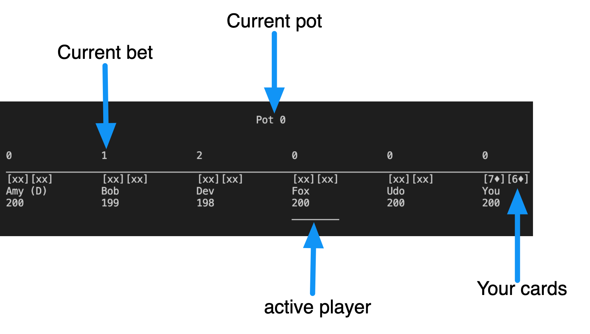

# Poker: Texas Holdem CLI game - built with Scala 3 <!-- omit in toc-->
[](https://travis-ci.com/Robert-Nickel/scala-texas-holdem)
[](https://coveralls.io/github/Robert-Nickel/scala-texas-holdem?branch=master)
 
*The coverage relates to the [Scala 2 version](https://github.com/Robert-Nickel/scala-texas-holdem/tree/scala2.13) of the project*

## Overview
A CLI version of Texas Holdem using **Scala 3** for the course "Reactive Programming" at HTWG WS20/21. 

## Table of contents
1. [Functional](#functional)
   1. [How to play](#how-to-play)
      1. [Starting the Game](#starting-the-game)
      2. [Playing the Game](#playing-the-game)
   2. [Bot logic](#bot-logic)
      1. [Preflop](#preflop)
      2. [Postflop](#postflop)
   3. [Yet missing Features](#yet-missing-features)
2. [Technological](#technological)

___
## Functional
All typical [cash game rules](https://www.pokerlistings.com/poker-rules-texas-holdem) are covered.  



### How to play
#### Starting the Game
You can play poker with one of two card deck. One has symbols on the cards (♥,♦,♣,♠), and one has letters (h,d,c,s).

To play with the symbols run  
```bash
sbt "run symbols"
```  
to play with letters run  
```bash
sbt "run letters"
```  
*HINT: h = hearts = ♥, d = diamonds = ♦, c = clubs = ♣, s = spades = ♠*  
The symbols are unicode characters that cannot be rendered by every console, use letters if you encounter rendering issues.

#### Playing the Game
You can use these commands if it is your turn:
```
fold
check
call
raise 42
all-in
```
Here is an example of how it looks if you call. Look at your current bet (that 6 above the betting line) to understand what is going on.
```
                                          Pot 0
                                            
                                                                                ⬇️
0               1               2               2               6               0               
________________________________________________________________________________________
[xx][xx]        [xx][xx]        [xx][xx]        [xx][xx]        [xx][xx]        [7♦][8♦]        
Amy (D)         Bob             Dev             Fox             Udo             You             
200             199             198             198             194             200             
                                                                                ________

call


                                          Pot 0
                                            
                                                                                ⬇️
0               1               2               2               6               6               
________________________________________________________________________________________
[xx][xx]        [xx][xx]        [xx][xx]        [xx][xx]        [xx][xx]        [7♦][8♦]        
Amy (D)         Bob             Dev             Fox             Udo             You             
200             199             198             198             194             194             
________

```
Here you have called Udo's bet of 6 with `[7♦][8♦]`.  

*If you ever get confused on what happened, have a look into what_happened.txt, where you can analyse your current match in detail.*

### Bot logic
You are playing against our bots **Amy, Bob, Dev, Fox and Udo** that make their actions based on multiple parameters.

#### Preflop
The bot evaluates his hand by
- If the values are high
- If the values are close to each other, which increases the chances to get a straight (cards are "connectors")
- If the values have the same symbol (cards are "suited")
If the evaluation of the hole cards is
- good, the bot will play aggressively
- mediocre, the bot will play passively
- bad, the bot is likely to fold

#### Postflop
After the flop, the bot evaluates his own hand in combination with the board. This is a more complex process, since the evaluation is multidimensional:
- The bot might have nothing
- The bot might have something, e.g. a pair
- The bot might have nothing yet, but a relatively high chance to get a flush or a straight (a "draw")  
   
All that is taken into consideration.  
One thing that is not taken into consideration is a differentiation between the absolute and the relative hand value.
If the board is a flush and the bot has no card of that suit, he will play aggressively, since he thinks he has a great hand, without taking into consideration, that EVERYONE has a flush.

### Yet missing Features
- [ ] Side pots, so that if two players with different stacks go all-in, they win different amounts. Reason: A player should not be able to win more than what he invested.

___

## Technological
Many different aspects of the Scala Programming Language and surrounding libraries are covered, therefore some effort is put onto the technology rather than the game itself.

You can find the basics (Introduction to Scala, More Scala, Tests, Functional Style and Monads) everywhere around the code. The more specific aspects and technologies are linked below:  

[Internal DSLs](https://github.com/Robert-Nickel/scala-texas-holdem/tree/master/src/main/scala/poker/dsl)

[External DSLs](https://github.com/Robert-Nickel/scala-texas-holdem/blob/scala2.13/src/main/scala/poker/dsl/HandHistoryParser.scala)

[Actors](https://github.com/Robert-Nickel/scala-texas-holdem/tree/kafka/src/main/scala/poker/actor)

[Reactive Streams](https://github.com/Robert-Nickel/scala-texas-holdem/blob/kafka/src/main/scala/poker/stream/EquityCalculator.scala)

[Kafka](https://github.com/Robert-Nickel/scala-texas-holdem/tree/kafka)

[Spark](https://github.com/Robert-Nickel/scala-texas-holdem/tree/spark)

[Scala 3](https://github.com/Robert-Nickel/scala-texas-holdem/tree/master)

To evaluate hands, we borrowed the solution from the TwoPlusTwo hand ranks evaluator as described [here](https://web.archive.org/web/20111103160502/http://www.codingthewheel.com/archives/poker-hand-evaluator-roundup#2p2).
To get the implementation of the evaluation done, we looked [here](https://github.com/chenosaurus/poker-evaluator), [here](https://github.com/LativDeveloper/PokerGym) and [here](https://github.com/tommy-a/zetebot/blob/master/src/tools/TwoPlusTwo.java).
